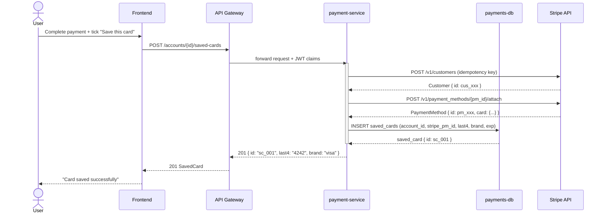

## Overview

This workflow bridges the gap between an architectural decision and a team ready to start coding. Each step produces an artefact that becomes the input contract for the next step, ensuring that testers are writing acceptance tests against the same design that architects and system designers approved.

**Cross-workstream value:**
- **Architects** produce a structured, version-controlled ADR so the design rationale is never lost in a meeting or Slack thread.
- **System Designers** turn that decision into concrete, executable artefacts (diagram + API contract) that remove ambiguity for developers.
- **Testers** receive the fully specified API surface and user flow, enabling them to write BDD acceptance tests before a line of implementation code is written — enabling true ATDD.

The final `DELIVERY_PACKAGE` is attached to the feature epic and linked from every child ticket.

**Audience:** Solution architects, system designers, tech leads, QA engineers, product engineers.

## Steps

### Step 1 — Generate an Architecture Decision Record `[Architects]`

**Asset used:** `arch-adr-generator`
**Input:** `{{FEATURE_DESCRIPTION}}`, `{{ARCHITECTURAL_DECISION}}`
**Output:** `ADR` — a complete MADR-format Architecture Decision Record.

```
[Prompt — paste into any LLM]

You are a software architect producing Architecture Decision Records (ADRs) in MADR format.

Feature: {{FEATURE_DESCRIPTION}}
Key architectural decision to record: {{ARCHITECTURAL_DECISION}}

Produce a complete ADR using this exact MADR structure:

# ADR-NNN: [Short title of the decision]

## Status
Proposed

## Context and Problem Statement
[What is the issue that motivates this decision? 2–4 sentences.]

## Decision Drivers
- [Driver 1]
- [Driver 2]

## Considered Options
1. [Option A]
2. [Option B]
3. [Option C]

## Decision Outcome
**Chosen option:** [Option X] — because [justification referencing the decision drivers].

### Positive Consequences
- [Consequence 1]

### Negative Consequences / Trade-offs
- [Trade-off 1]

## Pros and Cons of the Options

### Option A
- ✅ [Pro]
- ❌ [Con]

### Option B
- ✅ [Pro]
- ❌ [Con]

### Option C
- ✅ [Pro]
- ❌ [Con]

## Links
- Related to: [feature epic / ticket ID]
```

---

### Step 2 — Generate a Sequence Diagram `[System Designers]`

**Asset used:** `sysdesign-sequence-diagram-generator`
**Input:** `ADR` (Step 1), `{{USER_FLOW}}`, `{{FEATURE_DESCRIPTION}}`
**Output:** `SEQUENCE_DIAGRAM` — a Mermaid `sequenceDiagram` showing the main user flow.

```
[Prompt — paste into any LLM after Step 1]

You are a system designer producing Mermaid sequence diagrams for feature specifications.

Feature: {{FEATURE_DESCRIPTION}}
User flow: {{USER_FLOW}}

Architectural context from ADR:
{{ADR}}

Produce a complete Mermaid sequence diagram that shows every participant, every message,
and every asynchronous event in the main happy-path user flow. Include:
- All services/actors as participants (user browser, API gateway, backend services, databases, external APIs)
- Synchronous calls with solid arrows (->>)
- Asynchronous messages with dashed arrows (-->>)
- Activation boxes on services while they are processing
- alt/opt blocks for important conditional paths
- Note annotations for non-obvious behaviour

Output ONLY the Mermaid code block — no prose before or after.
```

---

### Step 3 — Generate an OpenAPI 3.0 Contract Stub `[System Designers]`

**Asset used:** `sysdesign-api-contract-prompt`
**Input:** `ADR` (Step 1), `SEQUENCE_DIAGRAM` (Step 2), `{{TARGET_ENDPOINTS}}`
**Output:** `API_CONTRACT` — an OpenAPI 3.0 YAML stub for all new or modified endpoints.

```
[Prompt — paste into any LLM after Step 2]

You are a system designer producing OpenAPI 3.0 contract stubs.

Feature: {{FEATURE_DESCRIPTION}}
Target endpoints: {{TARGET_ENDPOINTS}}

Architectural context from ADR:
{{ADR}}

Sequence diagram:
{{SEQUENCE_DIAGRAM}}

Generate a complete OpenAPI 3.0 YAML contract stub that covers every endpoint visible in the
sequence diagram. For each endpoint include:
- Path, HTTP method, operationId, summary, and description
- All path, query, and header parameters with types and descriptions
- Request body schema (if applicable) with required fields marked
- All response schemas (200/201, 400, 401, 404, 409, 500) with example values
- Security scheme reference (assume Bearer JWT unless ADR specifies otherwise)

Use $ref for reusable schemas. Output the complete YAML — no truncation.
```

---

### Step 4 — Generate BDD Acceptance Test Cases `[Testers]`

**Asset used:** `test-generate-test-cases-from-user-story`
**Input:** `ADR` (Step 1), `SEQUENCE_DIAGRAM` (Step 2), `API_CONTRACT` (Step 3)
**Output:** `ACCEPTANCE_TESTS` — Gherkin feature file + test case table.

```
[Prompt — paste into any LLM after Step 3]

You are a QA engineer writing BDD acceptance tests from a feature specification.

Feature: {{FEATURE_DESCRIPTION}}

ADR summary:
{{ADR}}

API contract:
{{API_CONTRACT}}

Generate a complete Gherkin feature file that covers:
1. The happy-path scenario for each new endpoint
2. Key sad-path scenarios (invalid input, missing auth, resource conflict)
3. Any conditional paths shown in the sequence diagram

Use Background for shared preconditions. Use Scenario Outline + Examples tables
for data-driven cases. Keep step definitions implementation-agnostic.

After the Gherkin file, produce a summary test case table:

| ID | Scenario | Given | When | Then | Priority |
|---|---|---|---|---|---|
```

---

## Flow Diagram

```
FEATURE_DESCRIPTION + ARCHITECTURAL_DECISION
              │
              ▼
┌──────────────────────────────┐
│  Step 1: Generate ADR         │  ◀── [Architects workstream]
│  arch-adr-generator           │
└──────────────┬───────────────┘
               │ ADR
               ▼
┌──────────────────────────────┐
│  Step 2: Sequence Diagram     │  ◀── [System Designers workstream]
│  sysdesign-sequence-          │
│  diagram-generator            │
│  + USER_FLOW (opt)            │
└──────────────┬───────────────┘
               │ SEQUENCE_DIAGRAM
               ▼
┌──────────────────────────────┐
│  Step 3: API Contract         │  ◀── [System Designers workstream]
│  sysdesign-api-contract-      │
│  prompt                       │
│  + TARGET_ENDPOINTS (opt)     │
└──────────────┬───────────────┘
               │ API_CONTRACT
               ▼
┌──────────────────────────────┐
│  Step 4: Acceptance Tests     │  ◀── [Testers workstream]
│  test-generate-test-cases-    │
│  from-user-story              │
└──────────────┬───────────────┘
               │
               ▼
         DELIVERY_PACKAGE
   (ADR + SEQUENCE_DIAGRAM +
    API_CONTRACT + ACCEPTANCE_TESTS)
```

## Usage

### Manual (Copilot Chat — current)

1. Write a clear `FEATURE_DESCRIPTION` and identify the `ARCHITECTURAL_DECISION` to record.
2. Run Step 1 to generate the ADR. Review and save as `ADR`.
3. Run Step 2 with the ADR pasted in. Save the Mermaid output as `SEQUENCE_DIAGRAM`.
4. Run Step 3 with the ADR and diagram pasted in. Save as `API_CONTRACT`.
5. Run Step 4 to generate Gherkin acceptance tests. Combine all four outputs into the feature epic.

### Automated (CI Pipeline — future)

```yaml
# .github/workflows/design-to-delivery.yml (illustrative)
on:
  workflow_dispatch:
    inputs:
      feature_description:     { required: true }
      architectural_decision:  { required: true }
      target_endpoints:        { required: false }
      user_flow:               { required: false }
jobs:
  generate-delivery-package:
    runs-on: ubuntu-latest
    steps:
      - uses: actions/checkout@v4
      - name: Run design-to-delivery workflow
        uses: org/ai-skills-action@v1
        with:
          workflow_id: shared-design-to-delivery-workflow
          inputs: ${{ toJson(github.event.inputs) }}
      - name: Commit artefacts to docs/
        run: git add docs/adr docs/api && git commit -m "docs: add delivery package for ${{ github.event.inputs.feature_description }}"
```

### API Endpoint (future portal)

```http
POST {{API_BASE_URL}}/packages/shared-cross-workstream-pack/invoke
Content-Type: application/json

{
  "workflow_id": "shared-design-to-delivery-workflow",
  "inputs": {
    "feature_description": "Add saved bank account as a payment method at checkout",
    "architectural_decision": "Whether to store bank account tokens in our own DB or delegate entirely to Stripe",
    "target_endpoints": "POST /accounts/{id}/saved-cards, GET /accounts/{id}/saved-cards, DELETE /accounts/{id}/saved-cards/{cardId}",
    "user_flow": "User navigates to checkout, selects Save this card, completes payment, card appears in saved cards list"
  }
}
```

## Examples

### Example — "Saved bank account" payment method

**Input:**
- `FEATURE_DESCRIPTION`: `Allow users to save a bank account (debit card) at checkout and reuse it for future payments without re-entering card details.`
- `ARCHITECTURAL_DECISION`: `Whether to store tokenised card references in our own database or rely entirely on Stripe's Customer + PaymentMethod objects as the system of record.`
- `TARGET_ENDPOINTS`: `POST /accounts/{id}/saved-cards, GET /accounts/{id}/saved-cards, DELETE /accounts/{id}/saved-cards/{cardId}`
- `USER_FLOW`: `User completes payment and ticks "Save this card" → frontend calls POST /accounts/{id}/saved-cards → payment-service creates a Stripe Customer + attaches PaymentMethod → stores Stripe PaymentMethod ID in our DB → returns saved card summary to frontend`

---

**Step 1 Output — ADR (excerpt):**

```markdown
# ADR-042: Card Token Storage Strategy for Saved Payment Methods

## Status
Proposed

## Context and Problem Statement
We are adding a "saved card" feature. We must decide whether to store Stripe
PaymentMethod IDs in our own database or treat Stripe's Customer object as the
sole system of record, querying Stripe's API at runtime.

## Decision Outcome
**Chosen option:** Store Stripe PaymentMethod IDs in our own DB (Option A) —
because it gives us sub-millisecond card list reads without Stripe API latency,
and we retain the ability to migrate PSPs without user-facing impact.

### Negative Consequences / Trade-offs
- We must keep our DB records in sync with Stripe (handle detach webhooks).
- Adds a migration path requirement if we switch PSPs.
```

---

**Step 2 Output — SEQUENCE_DIAGRAM:**

````markdown

````

---

**Step 3 Output — API_CONTRACT (excerpt):**

```yaml
openapi: "3.0.3"
info:
  title: Payment Service — Saved Cards API
  version: "1.0.0"
paths:
  /accounts/{accountId}/saved-cards:
    post:
      operationId: createSavedCard
      summary: Save a card to an account
      parameters:
        - name: accountId
          in: path
          required: true
          schema: { type: string }
      requestBody:
        required: true
        content:
          application/json:
            schema:
              $ref: '#/components/schemas/CreateSavedCardRequest'
      responses:
        '201':
          description: Card saved
          content:
            application/json:
              schema: { $ref: '#/components/schemas/SavedCard' }
        '409':
          description: Card already saved for this account
        '401':
          description: Unauthorised
components:
  schemas:
    CreateSavedCardRequest:
      type: object
      required: [stripePaymentMethodId]
      properties:
        stripePaymentMethodId: { type: string, example: "pm_1Abc123" }
    SavedCard:
      type: object
      properties:
        id:    { type: string, example: "sc_001" }
        last4: { type: string, example: "4242" }
        brand: { type: string, example: "visa" }
        expMonth: { type: integer, example: 12 }
        expYear:  { type: integer, example: 2028 }
```

---

**Step 4 Output — ACCEPTANCE_TESTS (excerpt):**

```gherkin
Feature: Saved payment cards

  Background:
    Given I am authenticated as account "acc_123"
    And the account has no saved cards

  Scenario: Successfully save a card at checkout
    Given I have completed a payment with Stripe PaymentMethod "pm_test_visa"
    When I call POST /accounts/acc_123/saved-cards with body { "stripePaymentMethodId": "pm_test_visa" }
    Then the response status is 201
    And the response body contains { "last4": "4242", "brand": "visa" }
    And the card appears in GET /accounts/acc_123/saved-cards

  Scenario: Cannot save the same card twice
    Given "pm_test_visa" is already saved for account "acc_123"
    When I call POST /accounts/acc_123/saved-cards with body { "stripePaymentMethodId": "pm_test_visa" }
    Then the response status is 409

  Scenario: Unauthenticated request is rejected
    Given I am not authenticated
    When I call POST /accounts/acc_123/saved-cards
    Then the response status is 401
```

| ID | Scenario | Given | When | Then | Priority |
|---|---|---|---|---|---|
| AC-01 | Save card successfully | Authenticated user, no saved cards | POST /saved-cards with valid PM ID | 201, card in list | P0 |
| AC-02 | Duplicate card rejected | Card already saved | POST /saved-cards same PM ID | 409 Conflict | P0 |
| AC-03 | Unauthenticated rejected | No JWT | POST /saved-cards | 401 Unauthorised | P0 |
| AC-04 | List saved cards | 2 cards saved | GET /saved-cards | 200, array of 2 | P1 |
| AC-05 | Delete saved card | Card exists | DELETE /saved-cards/{id} | 204, card gone from list | P1 |

## Testing Notes

| Model | Tested | Notes |
|---|---|---|
| gpt-4o | ✅ | 2026-04-20. ADR and API contract high quality. Mermaid diagram valid. Gherkin steps clear and implementation-agnostic. |
| claude-3-5-sonnet | ✅ | 2026-04-20. Produces more detailed Pros/Cons in ADR. Gherkin coverage is broader (more sad-path scenarios). |

## Changelog

### 1.0.0 — 2026-04-20
- Initial version. Cross-workstream combination of arch-adr-generator, sysdesign-sequence-diagram-generator, sysdesign-api-contract-prompt, test-generate-test-cases-from-user-story.
