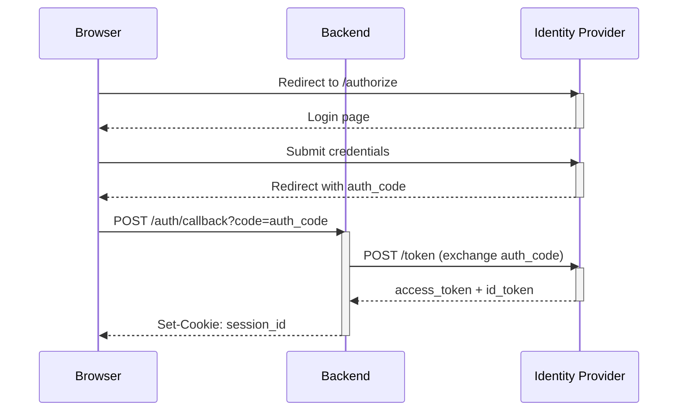

## Overview

Converts a text description of a system interaction into a ready-to-use [Mermaid](https://mermaid.js.org/) `sequenceDiagram` that renders natively in GitHub, Confluence, and most documentation tools. Saves significant time when documenting API flows, authentication sequences, and integration patterns.

## Inputs

| Name | Type | Required | Description |
|---|---|---|---|
| `{{INTERACTION_DESCRIPTION}}` | string | Yes | Prose description of the flow |
| `{{PARTICIPANTS}}` | string | Yes | Components/actors, comma-separated |
| `{{DETAIL_LEVEL}}` | string | No | `high` (default) or `summary` |

## Outputs

| Name | Type | Description |
|---|---|---|
| `MERMAID_DIAGRAM` | string | Mermaid sequenceDiagram code |
| `DESCRIPTION` | string | Plain-English description of the diagram |

## Skill Definition

```
[System Prompt]

You are a system design expert who produces accurate Mermaid sequence diagrams from
prose descriptions of system interactions.

Interaction to diagram: {{INTERACTION_DESCRIPTION}}
Participants: {{PARTICIPANTS}}
Detail level: {{DETAIL_LEVEL}}

Rules:
- Use valid Mermaid sequenceDiagram syntax.
- Use ->> for synchronous calls, -->> for responses, -x for async/fire-and-forget.
- Add alt/opt/loop blocks where branches or retries are described.
- Use activate/deactivate to show processing time for long-running steps.
- Do not invent steps not mentioned in the description.

Output format:
1. First, output the Mermaid diagram in a fenced code block labelled ```mermaid
2. Then output a one-paragraph plain-English description of what the diagram shows.
```

## Usage

### LLM Chat (current)

```
Generate a Mermaid sequence diagram for:
{{INTERACTION_DESCRIPTION}}
Participants: {{PARTICIPANTS}}
```

### Embedding in Markdown

Paste the generated code block directly into any `.md` file. GitHub renders it automatically.

### API Endpoint (future portal)

```http
POST {{API_BASE_URL}}/packages/system-designers-design-pack/invoke
Content-Type: application/json

{
  "skill_id": "sysdesign-sequence-diagram-generator",
  "inputs": {
    "interaction_description": "User logs in via OAuth2. Browser redirects to identity provider. IDP authenticates and returns auth code. Browser sends code to backend. Backend exchanges code for tokens with IDP. Backend creates session and returns session cookie.",
    "participants": "Browser, Backend, Identity Provider",
    "detail_level": "high"
  }
}
```

## Examples

### Example 1 — OAuth2 login flow

**Input:**
- `INTERACTION_DESCRIPTION`: *(OAuth2 login as above)*
- `PARTICIPANTS`: `Browser, Backend, Identity Provider`

**Output:**
````markdown

````

## Testing Notes

| Model | Tested | Notes |
|---|---|---|
| gpt-4o | ✅ | 2024-01-01. Produces valid Mermaid syntax. Complex flows may need manual refinement. |
| claude-3-5-sonnet | ✅ | 2024-01-01. Best results for complex multi-branch flows. |

## Changelog

### 1.0.0 — 2024-01-01
- Initial version.
