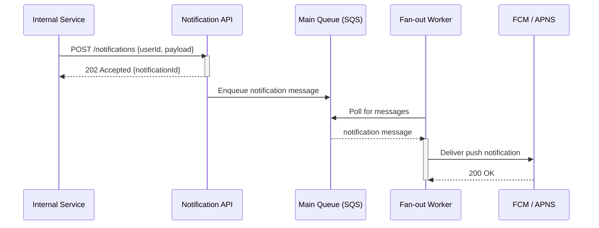

## Overview

This workflow guides a system designer from a brief description of a new system to a complete, review-ready design document. Each step builds on the previous, ending with a structured document that includes component definitions, sequence diagrams, API contracts, and a completeness review.

**Audience:** System designers, solution architects, tech leads, and senior engineers designing new services or significant features.

## Steps

### Step 1 — Extract System Components

**Asset used:** *(inline prompt)*  
**Input:** `{{DESIGN_BRIEF}}`, `{{DESIGN_GOALS}}`, `{{CONSTRAINTS}}`  
**Output:** `COMPONENTS` — a structured list of all system components, their responsibilities, and inter-component relationships.

```
[Prompt — paste into any LLM]

You are a senior solutions architect.

Design Brief:
{{DESIGN_BRIEF}}

Design Goals:
{{DESIGN_GOALS}}

Constraints:
{{CONSTRAINTS}}

Extract all system components needed to fulfil the brief. For each component:

**C-NNN: [Component Name]**
- Type: Service | Database | Queue | Cache | Gateway | External System | Client
- Responsibility: One sentence describing what this component does.
- Exposes: List of APIs or events it produces.
- Consumes: List of APIs or events it consumes from other components.
- Key design goals served: which goals from {{DESIGN_GOALS}} this component addresses.

After listing components, add a brief **Relationship Summary** paragraph describing the
high-level data and control flow between components.

Output only the component list and summary. No prose before or after.
```

---

### Step 2 — Generate Sequence Diagrams for Key Flows

**Asset used:** `sysdesign-sequence-diagram-generator`  
**Input:** `COMPONENTS` (from Step 1), `{{DESIGN_BRIEF}}`  
**Output:** `SEQUENCE_DIAGRAMS` — Mermaid sequence diagrams for the 2–3 most important flows.

```
[Prompt — paste into any LLM after Step 1]

You are a system design expert who produces Mermaid sequence diagrams.

System components:
{{COMPONENTS}}

Design brief:
{{DESIGN_BRIEF}}

Identify the 2–3 most important end-to-end flows in this system (e.g., the primary
happy path, the main error recovery path, and the most security-sensitive flow).

For each flow, produce:
1. A flow title and one-sentence description.
2. A Mermaid sequenceDiagram using only the components listed above as participants.
   - Use ->> for synchronous calls, -->> for responses.
   - Use alt/opt blocks where branching is described.
   - Do not invent participants not in the component list.
3. A one-paragraph plain-English explanation of what the diagram shows.

Rules:
- Use valid Mermaid sequenceDiagram syntax.
- Add activate/deactivate for long-running steps.
- Label all messages with the operation name (e.g., POST /orders, "Publish OrderCreated").
```

---

### Step 3 — Define API Contracts for Inter-Component Communication

**Asset used:** `sysdesign-api-contract-prompt`  
**Input:** `COMPONENTS` (from Step 1)  
**Output:** `API_CONTRACTS` — OpenAPI 3.0 YAML stubs for each component that exposes an HTTP API.

```
[Prompt — paste into any LLM after Step 2]

You are an API design expert.

For each component below that exposes an HTTP API, generate an OpenAPI 3.0 YAML contract stub.

Components:
{{COMPONENTS}}

For each API-exposing component:
1. Output the component name as a heading.
2. Produce a minimal but complete OpenAPI 3.0.3 YAML stub covering:
   - `info` block (title = component name, version: "1.0.0")
   - All paths implied by the component's "Exposes" list
   - Request/response schemas using $ref components
   - Standard error responses: 400, 401, 404, 500
   - Bearer auth security scheme (unless the component is internal-only)

Output each contract in a fenced ```yaml block under its component heading.
```

---

### Step 4 — Review Design for Completeness

**Asset used:** `sysdesign-system-design-review-agent`  
**Input:** All outputs from Steps 1–3, `{{DESIGN_GOALS}}`, `{{CONSTRAINTS}}`  
**Output:** `REVIEW_FINDINGS` — completeness score and improvement suggestions.

```
[Prompt — paste into any LLM after Steps 1–3]

You are a senior architect performing a completeness review of a system design.

Design goals: {{DESIGN_GOALS}}
Constraints: {{CONSTRAINTS}}

Component definitions:
{{COMPONENTS}}

Sequence diagrams:
{{SEQUENCE_DIAGRAMS}}

API contracts:
{{API_CONTRACTS}}

Review the design against the following completeness checklist:
1. All design goals have explicit mechanisms.
2. Error handling is described for each component.
3. Security: authentication and authorisation are defined.
4. Observability: logging, metrics, and alerting are mentioned.
5. Scalability: horizontal scaling or load balancing approach is stated.
6. Data persistence: storage approach and retention policy are defined.
7. All inter-component interfaces have documented contracts.
8. Deployment topology is described or implied.

For each checklist item that is partially or fully absent:

**FINDING-NNN: [Short title]**
- Severity: Critical | Major | Minor
- Checklist item: NNN
- What is missing: one sentence
- Recommendation: one actionable sentence

End with:
- A **Completeness Score** (0–100) with a one-sentence rationale.
- A **Next Steps** list of the top 3 actions to take.
```

---

## Flow Diagram

```
DESIGN_BRIEF + DESIGN_GOALS + CONSTRAINTS
         │
         ▼
[Step 1: Extract Components] ──▶ COMPONENTS
         │
         ▼
[Step 2: Generate Sequence Diagrams] ──▶ SEQUENCE_DIAGRAMS
         │
         ▼
[Step 3: Define API Contracts] ──▶ API_CONTRACTS
         │
         ▼
[Step 4: Review for Completeness] ──▶ REVIEW_FINDINGS
         │
         ▼
      SYSTEM_DESIGN_DOCUMENT
```

## Usage

### Manual (Copilot Chat — current)

1. Start a new Copilot Chat session.
2. Copy each step prompt in order, substitute the placeholders with your design brief and goals, and paste into GitHub Copilot Chat or your preferred LLM.
3. Save each step's output to use as input for the next step.
4. Combine all four outputs into a single design document (Markdown).

### Automated (GitHub Actions — current)

See `workstreams/system-designers/automations/diagram-generation-automation.md` for a GitHub Actions implementation that automates Steps 2 and 3 on PRs modifying design files.

### API Endpoint (future portal)

```http
POST {{API_BASE_URL}}/packages/system-designers-design-pack/invoke
Content-Type: application/json

{
  "workflow_id": "sysdesign-system-design-workflow",
  "inputs": {
    "design_brief": "A notification service that fan-outs push notifications to mobile clients...",
    "design_goals": "high availability, at-least-once delivery, sub-500ms p95 latency",
    "constraints": "AWS infrastructure, Node.js, GDPR"
  }
}
```

## Examples

### Example 1 — Notification service design

**Input:**
- `DESIGN_BRIEF`: `A push notification service that receives notification requests from internal services, fan-outs to device-specific queues, and delivers to FCM and APNS. Must handle 10 000 notifications/second at peak.`
- `DESIGN_GOALS`: `high availability, at-least-once delivery, sub-500ms p95 latency`
- `CONSTRAINTS`: `AWS (SQS, Lambda), Node.js, GDPR`

**Step 1 Output (COMPONENTS excerpt):**
```
**C-001: Notification API**
- Type: Service
- Responsibility: Receives notification requests from internal services and validates them.
- Exposes: POST /notifications
- Consumes: User Service — GET /users/{id}/devices
- Key design goals served: high availability (behind API Gateway + ALB)

**C-002: Fan-out Worker (Lambda)**
- Type: Service
- Responsibility: Consumes from the main SQS queue and routes to per-platform sub-queues.
- Exposes: (internal SQS consumer — no HTTP API)
- Consumes: SQS main-notifications-queue
- Key design goals served: at-least-once delivery, scalability via Lambda concurrency
```

**Step 2 Output (SEQUENCE_DIAGRAMS excerpt):**
````markdown
### Flow 1: Successful notification delivery


````

**Step 4 Output (REVIEW_FINDINGS excerpt):**
```
**FINDING-001: Dead-letter queue strategy not defined**
- Severity: Critical
- Checklist item: 2 (Error handling)
- What is missing: No DLQ or retry policy is described for the SQS queue.
- Recommendation: Add a DLQ with max-receive-count 3 and a CloudWatch alarm on DLQ depth.

Completeness Score: 65 / 100 — Core components and flows are present; error handling,
observability, and GDPR data retention are absent.
```

## Testing Notes

| Model | Tested | Notes |
|---|---|---|
| gpt-4o | ✅ | 2026-04-20. All four steps work end-to-end in a single Copilot Chat session. Step 3 YAML occasionally needs minor cleanup. |
| claude-3-5-sonnet | ✅ | 2026-04-20. Step 4 review findings are more detailed; Step 2 Mermaid syntax is cleaner. |

## Changelog

### 1.0.0 — 2026-04-20
- Initial version.
